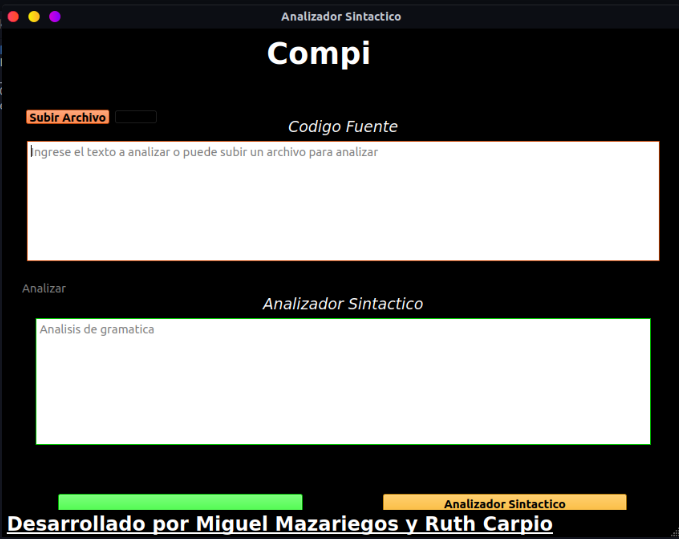

# *Analizadores*
Analizador de léxico y sintáctico usando PLY ( Implementación de herramienta de análisis Lex-Yacc para Python)

## Desarrollado para el curso de compiladores

### Integrantes 
---
- Miguel Mazariegos
- Ruth Carpio